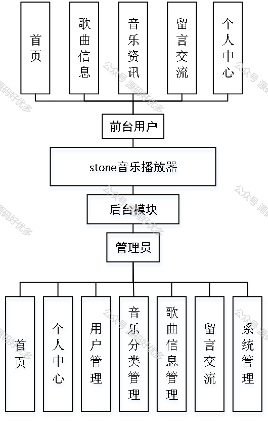
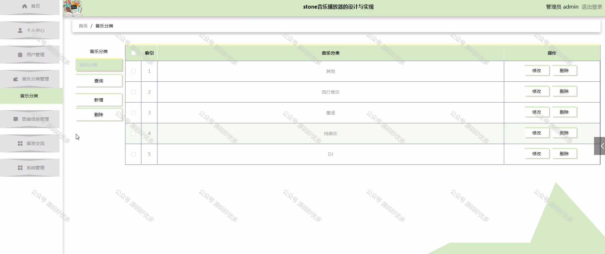
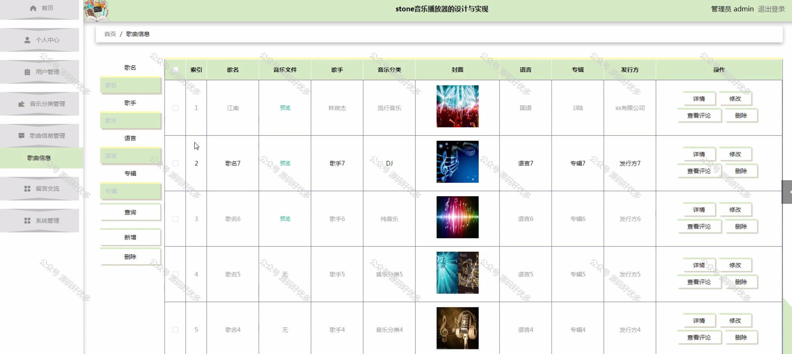
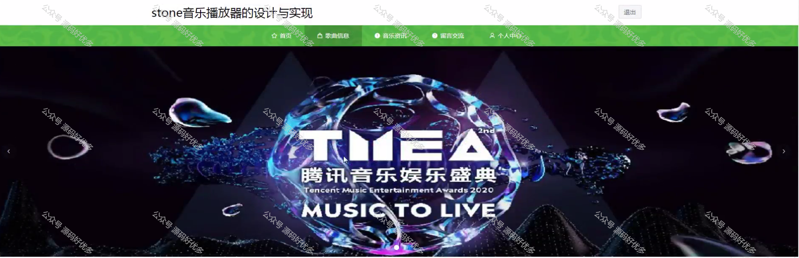
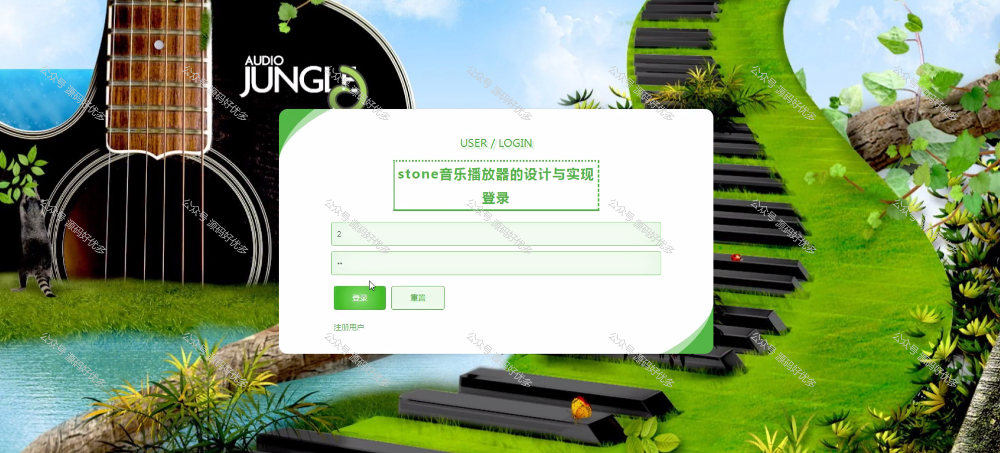
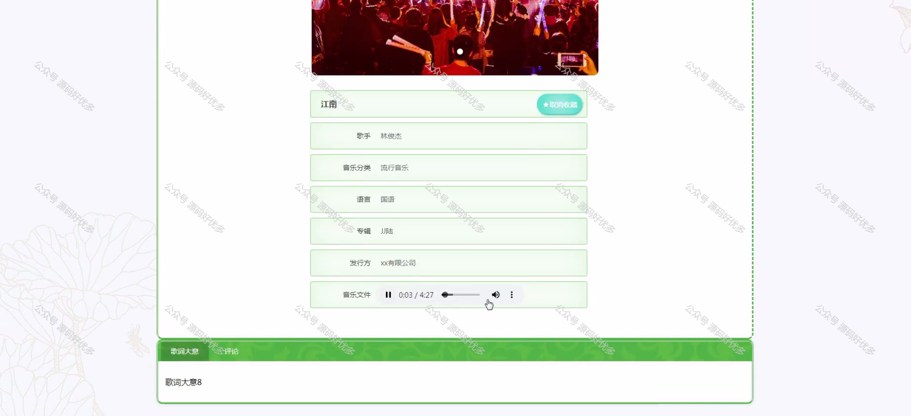
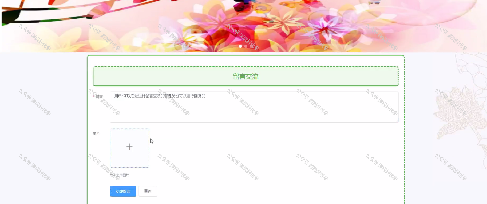
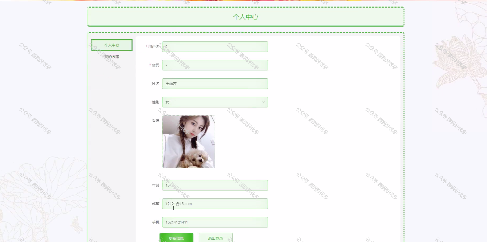
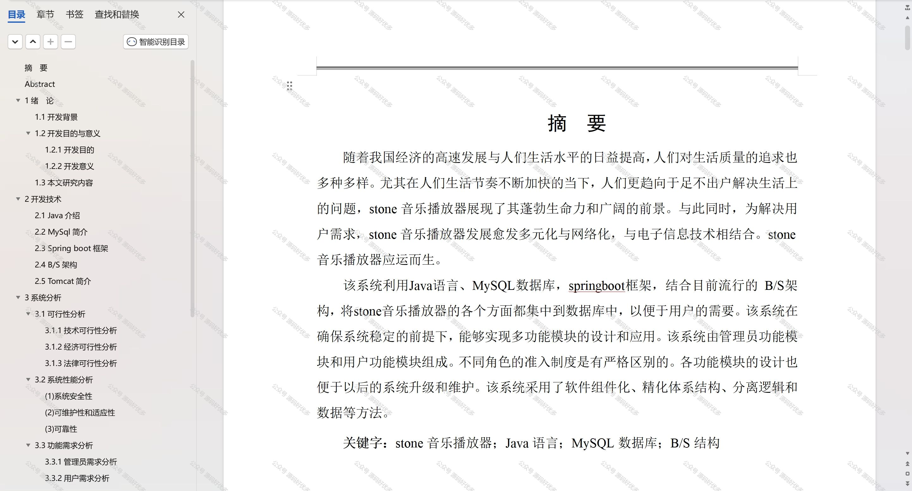

 
## 查看主页获取源码

> **作者介绍**： **✌**全网粉丝10W+本平台特邀作者、博客专家、CSDN新星计划导师、java领域优质创作者,博客之星、掘金/华为云/阿里云/InfoQ等平台优质作者、专注于项目实战 **✌**

  

### 一、作品包含

源码+数据库+设计文档万字+PPT+全套环境和工具资源+部署教程

### 二、项目技术

前端技术：Html、Css、Js、Vue、Element-ui

数据库：MySQL

后端技术：Java、Spring Boot、MyBatis

  

### 三、运行环境

开发工具：IDEA/eclipse

数据库：MySQL5.7

数据库管理工具：Navicat10以上版本

环境配置软件： JDK1.8+Maven3.6.3

前端Nodejs：14

### 四、项目介绍
项目编号：springbootA131

在当今信息化社会，数字音乐已成为人们日常生活中不可或缺的一部分，音乐播放器作为数字音乐传播的重要载体，其功能和性能的优化成为了研究的热点。本文旨在探讨音乐播放器系统的设计与实现，背景是当前音乐市场对个性化服务、用户体验提升和版权保护的需求日益增长。通过对音乐播放器系统的深入研究，本文将分析现有系统的不足，提出一种创新的系统架构和实现方案，以期为音乐产业的持续发展和用户音乐体验的改善提供理论依据和技术支持。

前台用户功能：首页、歌曲信息、音乐资讯、留言交流和个人中心。

后台管理员的功能：首页、个人中心、用户管理、音乐分类管理、歌曲信息管理、留言交流、系统管理。

### 五、运行截图

  
